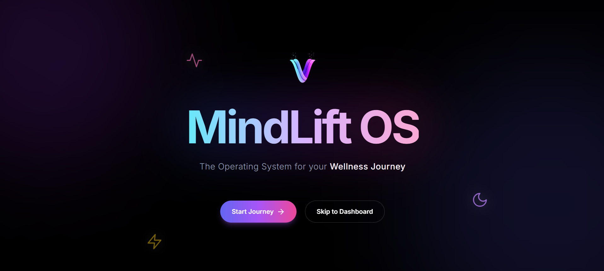
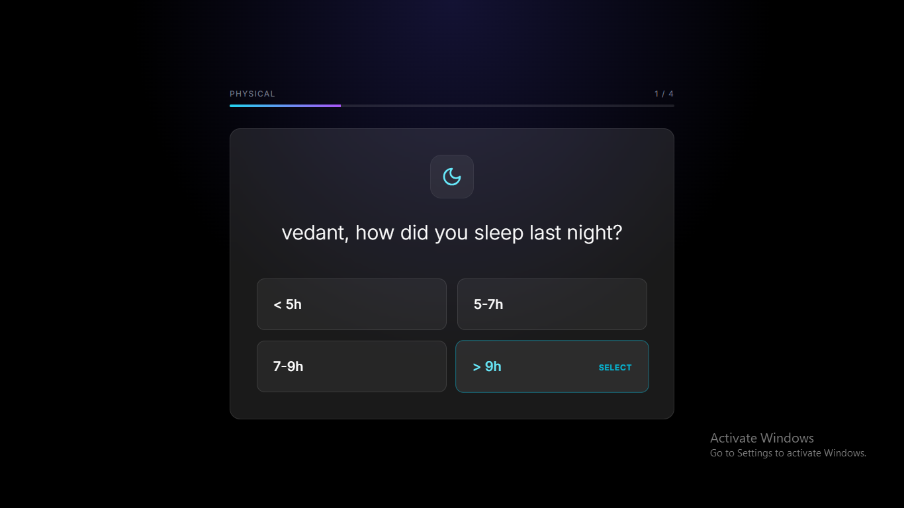
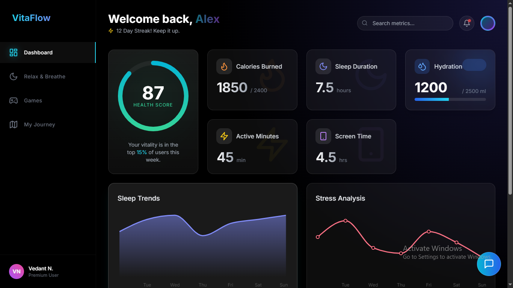
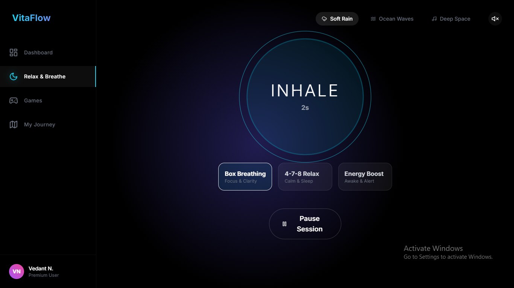
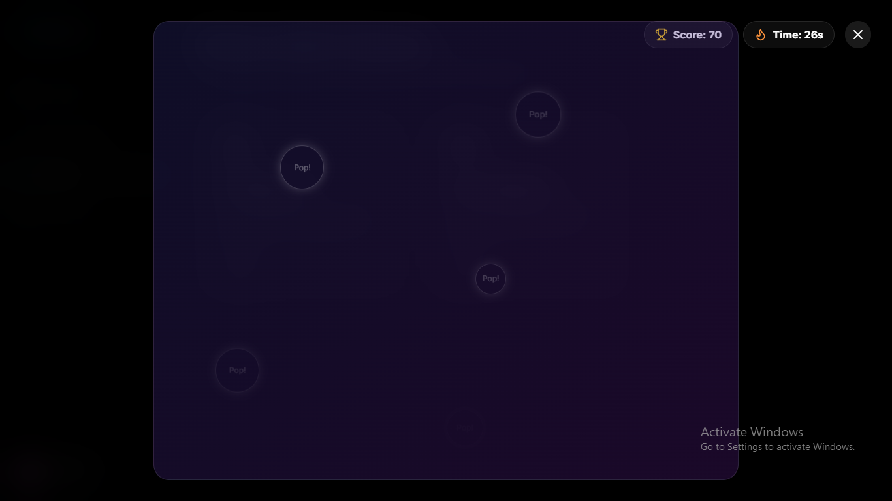
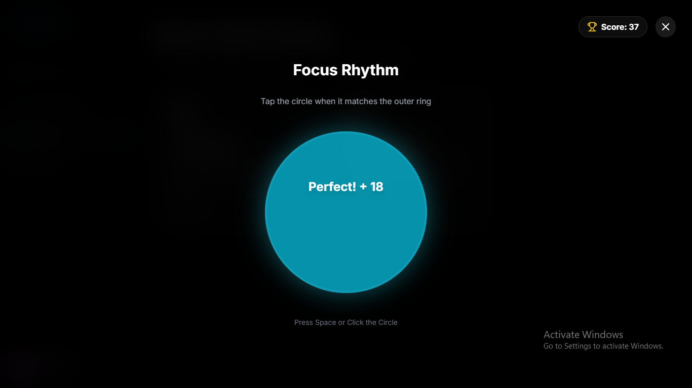
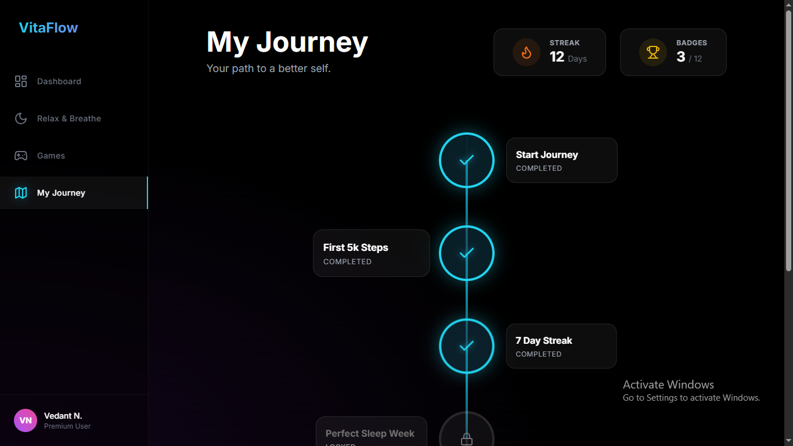
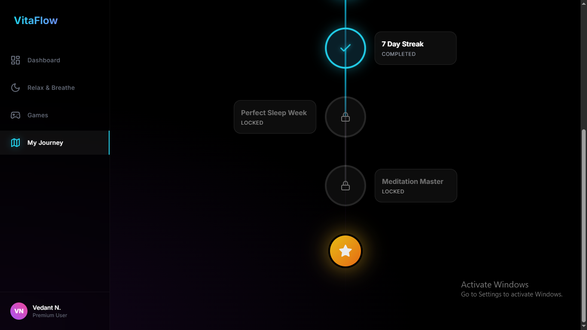

# 🌿 MindLift OS

### AI-Inspired Interactive Wellness Journey Platform

### _A cinematic, animated, and gamified healthcare experience built with React_

---

## 🚀 Overview

**MindLift OS** is a next-generation, interactive wellness platform that transforms daily health tracking into a **visual story-driven journey**.

Unlike traditional dashboards or chatbots, MindLift creates an **immersive Health Operating System experience** using:

- smooth animations
- motion design
- glassmorphism UI
- gamification
- interactive storytelling
- guided wellness tools

It helps users:

✔ understand their lifestyle
✔ monitor health metrics
✔ reduce stress
✔ build healthy habits
✔ improve mental & physical wellness

All built using **frontend only (static data)** with **React + Tailwind CSS**.

---

# 🎯 Problem Statement

Modern health apps are:

❌ boring dashboards
❌ text-heavy
❌ overwhelming
❌ not engaging
❌ difficult to stay consistent

People stop using them quickly.

---

# 💡 Solution

MindLift OS solves this by turning health tracking into:

### ✨ A Story + Dashboard + Coach + Games + Journey

Instead of data overload, users experience:

> Assess → Understand → Improve → Relax → Grow

Health becomes **interactive, visual, and enjoyable**.

---

# 🌈 Design Philosophy

### Inspired by

- Apple Health
- Headspace
- Fitbit
- Tesla UI
- Glassmorphism dashboards

### Visual Style

- glass cards
- glow effects
- gradients
- soft shadows
- neon highlights
- floating components
- smooth transitions
- micro-interactions

### Experience Goals

- aesthetic
- satisfying
- creative
- motion-rich
- visually immersive
- premium feel

---

# 🧠 Core Concept (Story Flow)

```
Welcome
   ↓
Health Assessment
   ↓
Health Score Reveal
   ↓
Smart Dashboard
   ↓
Daily Journey
   ↓
Relax & Breathing
   ↓
Games & Detox
   ↓
Insights & Rewards
```

Users feel like they’re moving through a **health journey**, not using a static app.

---

# 🧩 Features

---

## 🟢 1. Cinematic Onboarding & Health Assessment

Interactive quiz to understand lifestyle.

### Includes

- animated step cards
- slide transitions
- progress bar waves
- score calculation
- animated gauge reveal

### Metrics Collected

- sleep
- stress
- activity
- screen time
- food habits
- mood

---

## 🔵 2. Smart Wellness Dashboard

### Shows

- health score ring
- calorie tracking
- sleep graphs
- stress charts
- active minutes
- screen time
- detox status
- mood status
- notifications
- daily insights

### UI Elements

- glass cards
- animated charts
- glowing borders
- hover lift effects
- counters

---

## 🟣 3. AI-Inspired Wellness Coach (Static Simulation)

> No real AI API used (mocked logic)

### Features

- chat interface
- predefined suggestions
- wellness tips
- guided messages
- voice-like typing animation

Simulates AI behavior with static data.

---

## 🟠 4. Breathing & Relaxation Studio

### Includes

- breathing exercise circle
- inhale/exhale timer
- guided steps
- calm animations
- sound wave visualization

Helps reduce stress in real time.

---

## 🟡 5. Mood & Detox Tracker

### Includes

- emoji mood slider
- gradient mood backgrounds
- screen time tracking
- detox countdown
- streak tracking

---

## 🔴 6. Gamified Relief Zone

Mini-games to reduce anxiety.

### Example Games

- tap-to-calm bubbles
- breathing rhythm game
- focus timer challenge
- memory relax game

Encourages engagement and fun.

---

## 🟢 7. Daily Journey Map

Gamified progress path.

### Includes

- step completion
- animated path
- badges
- streak flames
- rewards

Feels like Duolingo-style health progression.

---

## ⚪ 8. Notifications & Timers

- hydration reminder
- stretch alert
- sleep reminder
- meditation timer
- focus timer
- Every 3 seconds random

Animated toast notifications.

---

## ⚫ 9. Fully Responsive

- mobile
- tablet
- desktop

Designed mobile-first.

## ⚫ 10. Light and Dark Mode

Designed mobile-first.

---

# ✨ Animations & Motion System

## Page Level

- slide transitions
- fade transitions
- shared layout animation
- route transitions

## Component Level

- hover lift
- glow effects
- counters
- graph drawing
- ripple clicks
- card flips
- skeleton loaders

## Special Effects

- confetti
- pulse rings
- gradient shifts
- parallax
- blur glass

---

# 🛠 Tech Stack

## Frontend

- React.js
- Tailwind CSS

## Animation

- Framer Motion
- CSS transitions
- Lottie (optional)

## Charts

- Recharts / Chart.js

## Data

- Static JSON
- No backend
- No AI API

---

# 📁 Folder Structure

```
src/
 ├─ components/
 │   ├─ dashboard/
 │   ├─ charts/
 │   ├─ coach/
 │   ├─ breathing/
 │   ├─ games/
 │   ├─ journey/
 │   └─ ui/
 │
 ├─ pages/
 │   ├─ Home
 │   ├─ Assessment
 │   ├─ Dashboard
 │   ├─ Relax
 │   ├─ Games
 │   └─ Journey
 │
 ├─ data/
 │   ├─ metrics.json
 │   ├─ tips.json
 │   ├─ mood.json
 │
 ├─ hooks/
 ├─ utils/
 └─ App.jsx
```

---

# 📊 Static Data Strategy

All data stored in JSON:

### Example

```json
{
  "calories": 1800,
  "sleep": [6, 7, 8, 5, 7],
  "stress": [40, 60, 30, 20, 45],
  "mood": "happy"
}
```

Simulates real tracking without backend.

---

# 🎮 Demo Flow (Important for Judges)

### Step 1

Show animated onboarding

### Step 2

Reveal health score with gauge

### Step 3

Open dashboard (charts animate)

### Step 4

Start breathing exercise

### Step 5

Play mini-game

### Step 6

Show journey progress + rewards

Creates “wow” moments.

---

# 🎯 Why This Project Wins

Compared to normal healthcare apps:

| Normal Apps      | MindLift OS      |
| ---------------- | ---------------- |
| static dashboard | animated journey |
| plain UI         | glassmorphism    |
| boring charts    | cinematic graphs |
| no engagement    | games            |
| no story         | storytelling     |
| forgettable      | memorable        |

Judges remember **experience**, not complexity.

---

# 🔮 Future Scope

- real wearable integration
- AI health predictions
- voice assistant
- backend sync
- cloud storage
- smart notifications
- doctor consultation

---

# Screenshots









---


# 👨‍💻 Built With

React.js + Tailwind CSS
Frontend only • Static data or little moving from data folder • No backend

---

### 🌿 Stay healthy. Stay flowing. Welcome to MindLift.
